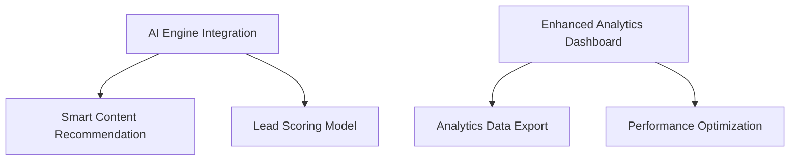

# Sprint Plan - January 24 - February 6, 2025

## Sprint Goal

Establish the foundation for AI-powered marketing features while improving the analytics
capabilities to support data-driven decision making.

## Selected Items

### P0 (Highest Priority)

1. **Enhanced Analytics Dashboard Base Implementation** (5 SP)

- Create real-time performance dashboard framework
- Implement core metrics visualization
- Setup data pipeline for analytics processing
- Dependencies: None
- Risk: Data processing performance might impact dashboard responsiveness

2. **AI Engine Integration Setup** (8 SP)

- Setup AI service connections
- Implement API authentication and security
- Create base AI service wrapper
- Dependencies: None
- Risk: Third-party AI service reliability

3. **Smart Content Recommendation MVP** (5 SP)

- Implement basic content suggestion algorithm
- Create recommendation UI components
- Setup feedback loop mechanism
- Dependencies: AI Engine Integration
- Risk: Algorithm accuracy in early stages

### P1 (Medium Priority)

4. **Analytics Data Export Feature** (3 SP)

- Add export functionality for dashboard data
- Implement multiple format support (CSV, PDF)
- Create export scheduling options
- Dependencies: Enhanced Analytics Dashboard
- Risk: Large dataset handling

5. **Lead Scoring Model Foundation** (5 SP)

- Implement basic scoring criteria
- Create scoring calculation engine
- Setup score visualization
- Dependencies: AI Engine Integration
- Risk: Initial model accuracy

### P2 (Lower Priority)

6. **Performance Optimization for Analytics** (3 SP)

- Implement data caching
- Optimize query performance
- Add lazy loading for dashboard components
- Dependencies: Enhanced Analytics Dashboard
- Risk: Cache invalidation complexity

## Total Story Points: 29

## Sprint Dependencies

## Definition of Done

- ✅ Code complete and reviewed
- ✅ Unit tests written and passing
- ✅ Integration tests passing
- ✅ Performance tests show no degradation
- ✅ Documentation updated
- ✅ Accessibility compliance verified
- ✅ Product Owner approval obtained
- ✅ Successfully deployed to staging environment
- ✅ QA verification completed
- ✅ No P0/P1 bugs open

## Sprint Risks and Mitigation

1. **AI Service Integration**

    - Mitigation: Early spike solution and fallback implementation plan
    - Daily monitoring of AI service status

2. **Data Processing Performance**

    - Mitigation: Implement incremental loading and caching
    - Performance testing with production-like data volumes

3. **Model Accuracy**
    - Mitigation: A/B testing framework for recommendation algorithms
    - Gradual rollout strategy

## Success Metrics

- All P0 items completed
- Analytics dashboard responds within 2 seconds
- AI recommendations have >70% relevance score
- No regression in existing features
- All DoD items met for completed stories

## Sprint Planning Notes

- Daily standups at 10:00 AM EST
- Mid-sprint review on January 31
- Sprint demo scheduled for February 6
- Buffer time allocated for unexpected AI integration challenges

This sprint focuses on laying the groundwork for AI features while ensuring the analytics foundation
is solid. The selected items balance technical infrastructure work with user-facing features.
